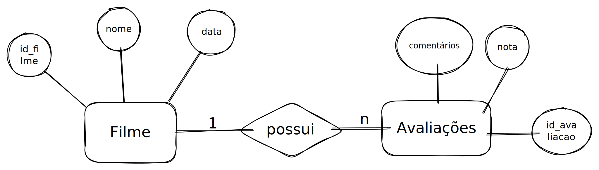
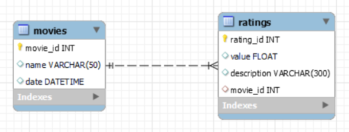

# Fast api demo

**Alunos:** Eduardo Araujo e Paulo Falcão
**Data:** 28/04/2023

### Sobre o projeto

A intenção do projeto é desenvolver um microsserviço de controle de filmes e avaliações de filmes. Para isso vamos desenvolver uma API seguindo os padrões REST, utilizando **FAST API** e futuramente, **SQLAlchemy** para a interação com o banco de dados!

### Requerimentos
- Usuário pode gerenciar o cadastro de filmes e o cadastro de avaliações de
filmes
- A avaliação deve ter pelo menos a indicação do filme, um campo
de texto livre para comentários e algum esquema de voto (nota de
satisfação de 0.0 a 10.0 ou variável categórica ordinal com níveis
de satisfação)

- O usuário pode listar as avaliações de um produto.





### Como instalar o projeto

Para instalar o projeto, primeiramente deve-se instalar os pacotes encontrados no arquivo *requirements.txt*

```
pip install -r requirements.txt
```

Após isso, basta rodar o seguinte comando no diretório do repositório:

```
uvicorn main:app --reload
```

Feito isso, para acessar a API, basta entrar no link que aparecerá no terminal.
